**Please cite this paper when you use this simulator in your publications/lectures/presentations:**

**M. Aibin and M. Blazejewski, "Complex Elastic Optical Network Simulator (CEONS)," 2015 17th International Conference on Transparent Optical Networks (ICTON), Budapest, 2015, pp. 1-4. doi: 10.1109/ICTON.2015.7193519**

British Columbia Institute of Technology, Faculty of Computing

All Rights Reserved 

Copyright© 2019

CEONS runnable JAR file with two sample networks can [be downloaded from here](http://bit.ly/BCIT_CEONS "Download CEONS").

# I.  Introduction

The Complex Elastic Optical Network Simulator (CEONS) is an open-source desktop application that allows network scientists visualize the statistics and behavior of various optical network topologies using different simulation settings (e.g., algorithms, traffic generators, network requests types/intensity).

This simulator was originally developed by Dr. Michal Aibin and M. Blazejewski as a test environment to allow users to design their own algorithms in any programming language and implement them in the simulator as plugins to solve the aforementioned problems.  The results of each simulation were displayed onto the console showing the overall blocking percentage of all regenerators/link spectrum, and link failures.  

Since then, the simulator has evolved to illustrate the network topology within a geographical region and allow users to pause the simulation in real-time to observe resource utilization within each node or link.  In the future, users will have the option to create their own network topologies, where node locations can be specified with their group membership type, number of regenerators, and node linkage.

This user reference is intended to guide users through the specific use-cases in the graphical user interface provided by the desktop application.  For the creation of this document, we used a Windows operating system running IntelliJ on Java SE Development Kit 8.  We assume that you have the development environment set up or a Java ARchive (JAR) package file to run the simulation.

If not, please visit the following links to download the recommended resources:

<table>
  <tr>
    <td>JDK 8</td>
    <td>https://www.oracle.com/technetwork/java/javase/downloads/jdk8-downloads-2133151.html</td>
  </tr>
  <tr>
    <td>IntelliJ community edition</td>
    <td>https://www.jetbrains.com/idea/download/download-thanks.html?platform=windows&code=IIC</td>
  </tr>
  <tr>
    <td>GitHub repository</td>
    <td>https://github.com/BCIT-SoCAS/ceons</td>
  </tr>
</table>

# II.  Reference Overview

Upon setup completion, you will be able to run the simulator with the following major features:

1. Load network topology from saved .eon files and have it displayed onto the map area

2. Prior to simulation start:

    1. Set algorithm, traffic generator, erlang, seed, alpha, demand count values

    2. Enable backup replica preservation

    3. Enable ability to change modulation on path

    4. Choose allowed modulations

    5. Set number of candidate paths

3. During simulation:

    6. Pause simulation

        1. Select specific nodes to display their group membership, node number, linked nodes, and regenerators remaining

        2. Select specific links to display their length, start/end node, link usage percentage

    7. Cancel or clear simulation

4. Create network topology (Currently in development)

    8. Saving Google Maps API key to file

    9. Customize node locations and connected nodes, number of regenerators, and group membership type

# III.  Navigating the application

## 1) Major components

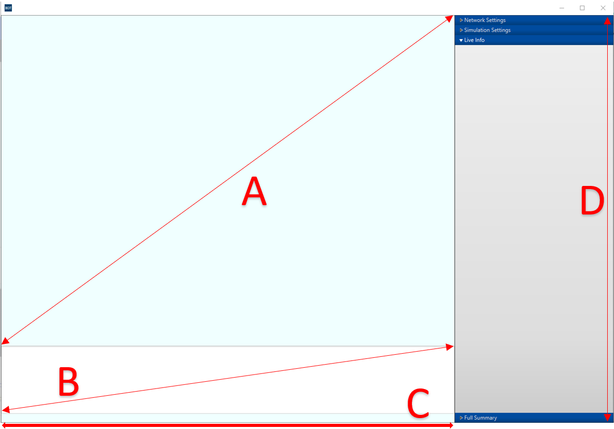

<table>
  <tr>
    <td>Reference Letter</td>
    <td>Component </td>
  </tr>
  <tr>
    <td>A</td>
    <td>Area to hold the map and network topology</td>
  </tr>
  <tr>
    <td>B</td>
    <td>Console for status updates </td>
  </tr>
  <tr>
    <td>C</td>
    <td>Progress bar for map load and simulation</td>
  </tr>
  <tr>
    <td>D</td>
    <td>Network, Simulation, Live Info, Full Summary pane</td>
  </tr>
</table>

## 2) Network Settings Controller

**A:** Create topology button that opens up a dialog window where a user can enter a google maps API key.  Once entered the user can generate a network topology to be loaded.

**B:** Load topology button that opens up a file chooser to load .eon files onto the map and network topology area.

**C:** Changes the drawing state to allow user to select a node or link on a loaded network topology.  Once clicked, this displays information in the Live Info pane.

**D:** Changes the drawing state to none, which has no effect upon user interaction with a loaded network topology.

## 3) Simulation Settings Controller

**A:** Choose between algorithm types (e.g., AMRA, SPF), which dictate how routing occurs in the network and/or how optical resources are allocated.

**B:** Choose between traffic generator types (e.g., No backup, Shared backup, and Dedicated backup).  This is the ability for a network to recover from resource failures.

**C:** Erlang number input determines the network traffic intensity

**D:** Seed number input is used by a random number generator to make the same simulation multiple times (produces same result) 

**E:** Alpha number input determines the probability of link failure 

**F:** Demands count number input is the number of demands in the network

**G:** Allows replica (data center) to be preserved

**H:** Allows modulation to be changed dynamically in simulation

**I:** Modulation types to be used during simulation

**J:** Number of paths each request can take to reach a destination

**K:** Begins simulation

**L:** Pause simulation or Resumes simulation (if paused)

**M:** Cancels running simulation or reloads simulation if not running

## 4) Live Info Pane

This section holds live information when the simulation is started and paused.  If a node or link is clicked on when the simulator is paused, it displays the resource usage.  

A node would display it’s group membership (international/data center/standard), how many regenerators it has left, and the other nodes it is attached to.

A link would display the the length of the link, the node it originates from/the node it ends on, and the link spectrum usage.

If neither node or link is clicked on it will display current summary statistics of blocking percentages for regenerators, link and blocked spectrum.

## 5) Full Summary Pane

This section is currently under development.  The idea for this area is to hold aggregated graphical information after multiple simulations are run.

## 6) Network topology with nodes and links

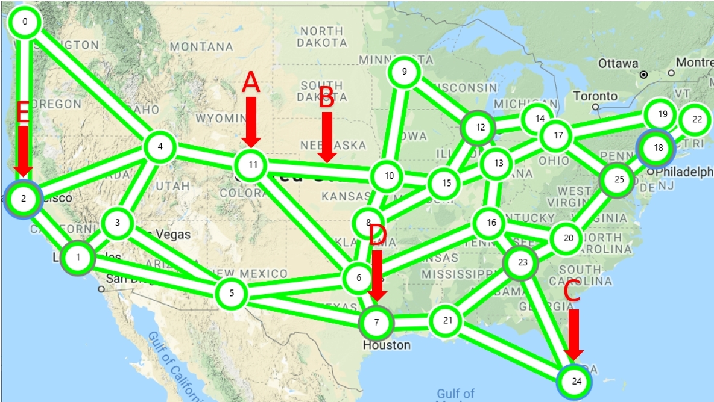

<table>
  <tr>
    <td>Reference Letter</td>
    <td>Component</td>
  </tr>
  <tr>
    <td>A</td>
    <td>Standard node (indicated by white outline)  

Number refers to node number (e.g., node_<num>) in network topology  

The thicker colored line in the node indicates regenerator usage 
Green: Has more than 50 regenerators remaining
Yellow: Less than 50 regenerators remaining 
Red: Less than 20 regenerators remaining</td>
  </tr>
  <tr>
    <td>B</td>
    <td>Link slice 

The thick colored line in the link indicates the percentage of link use
Green: 50% or less link usage
Yellow: More than 50% link usage
Red: More than 80% link usage</td>
  </tr>
  <tr>
    <td>C</td>
    <td>International node (indicated by blue outline)</td>
  </tr>
  <tr>
    <td>D</td>
    <td>Data center node (indicated by grey outline)</td>
  </tr>
  <tr>
    <td>E</td>
    <td>International and data center node (indicated by blue and grey outline)</td>
  </tr>
</table>

# IV.  To load network topology

 1. Click** Load Topology **button.

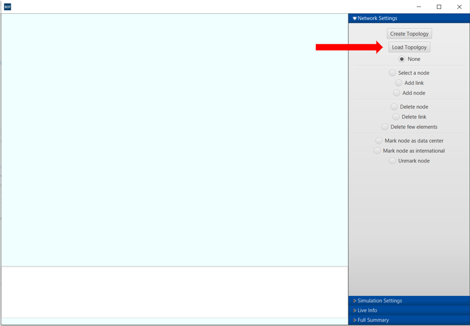

Figure A: Main Menu controller showing network settings

2. Select the available **.eon file** containing complete network topology

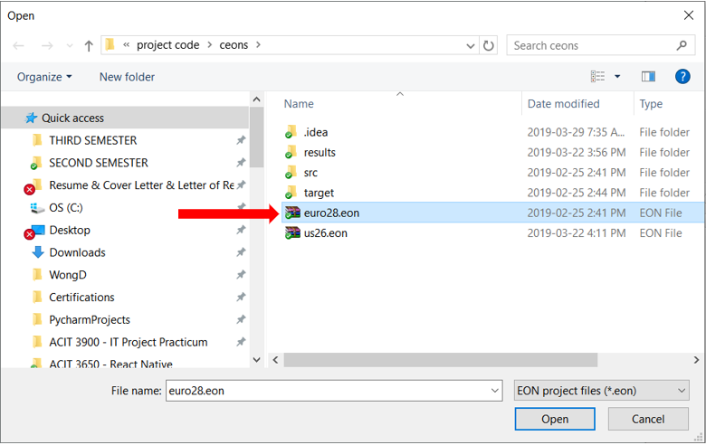

Figure B: File chooser to select .eon file types

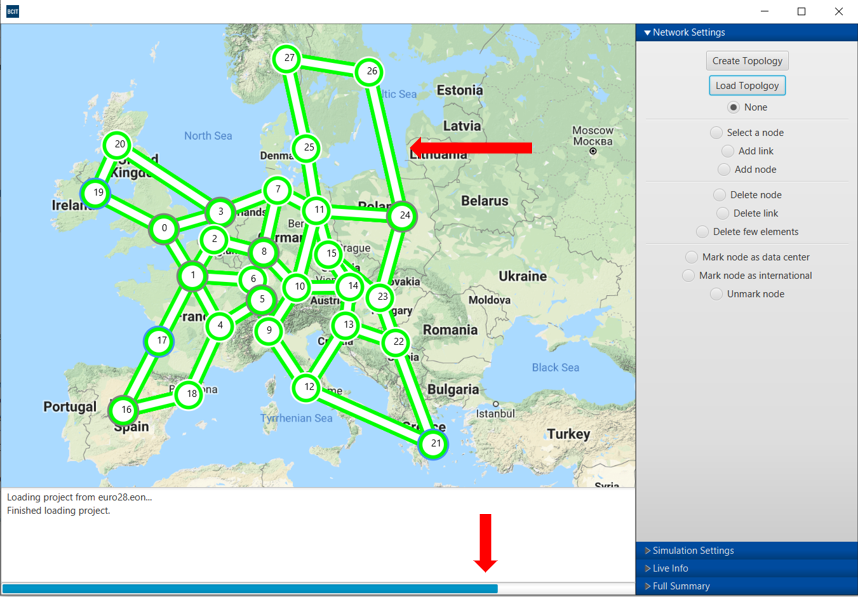

Figure C: Main Menu controller showing network settings

3. Once the selected file is opened, the project will be loaded to calculate the paths available in the network. You must wait for paths to calculate before starting the simulator.

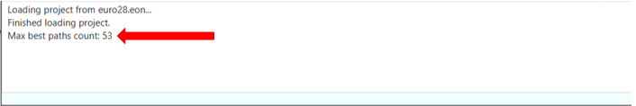

Figure D: Console showing fully loaded project with calculated paths

# V.  To run simulation

1. In **Simulation Settings **section of the main window:

1. Select **Algorithm**.

2. Select **Traffic Generator.**

3. Type **Erlang**, **Seed**, **Alpha** and **Demands Count.** 

4. Select/unselect **Backup replica preservation?**

5. Select/unselect **Change modulation on path?**

6. Select **Allowed Modulations.**

7. Type **Number of candidate paths.**

2. Press **Start Simulation**.

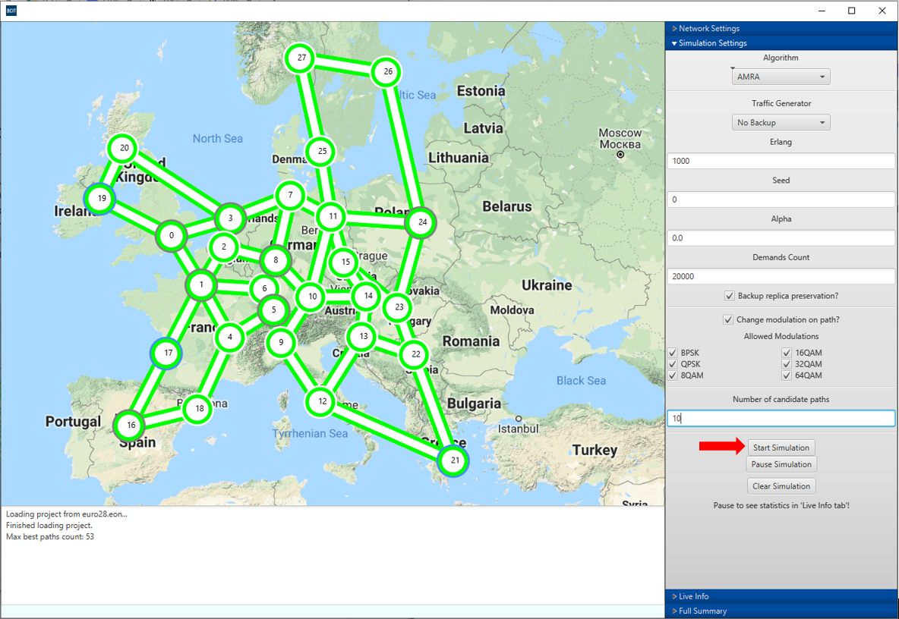

Figure A: Loaded Euro28 network topology

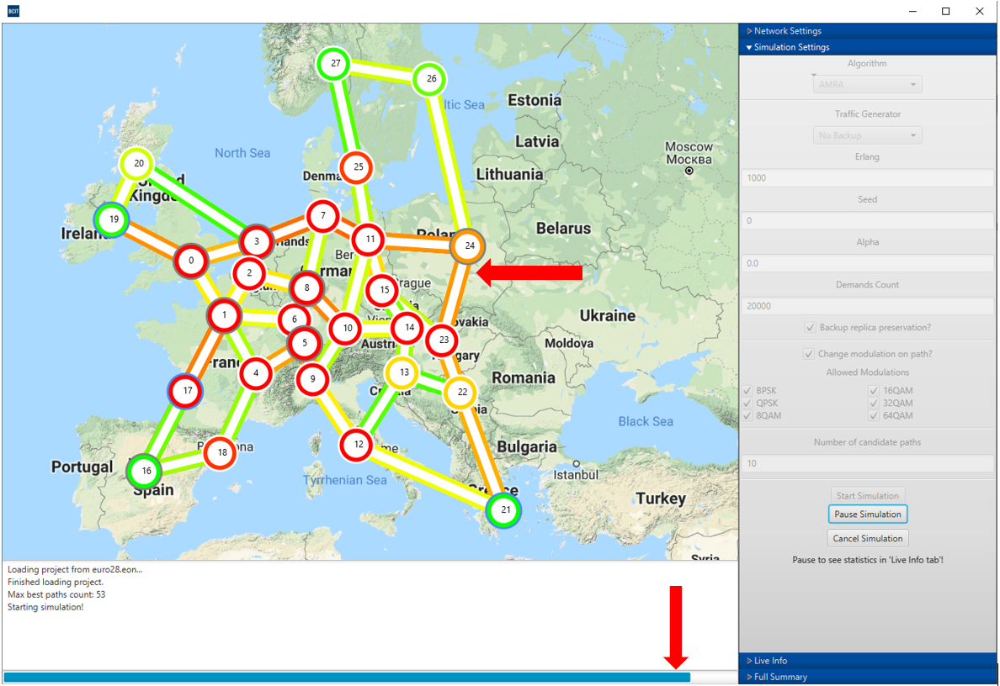

Figure B: Network simulation in progress showing link and regenerator usage

# VI.  To cancel/clear simulation

## 1) Simulation in progress

1. In **Simulation Settings, **click **Cancel Simulation**

2. Click **OK** 

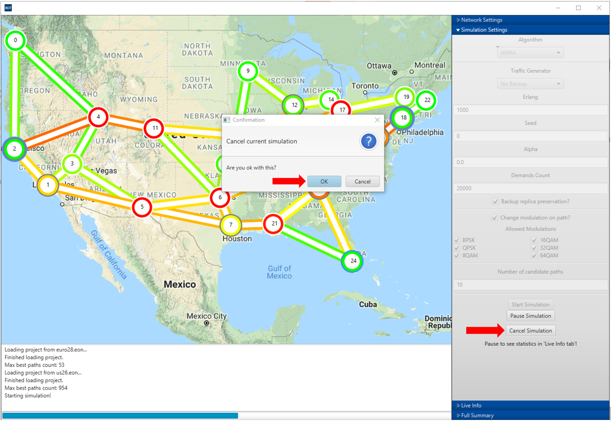

Figure A: Canceling the simulation while it’s running

## 2) Simulation Finished

1. In **Simulation Settings**, click **Clear Simulation**

2. Click **OK **(or **Cancel** to resume)

3. Wait for network topology to finish loading

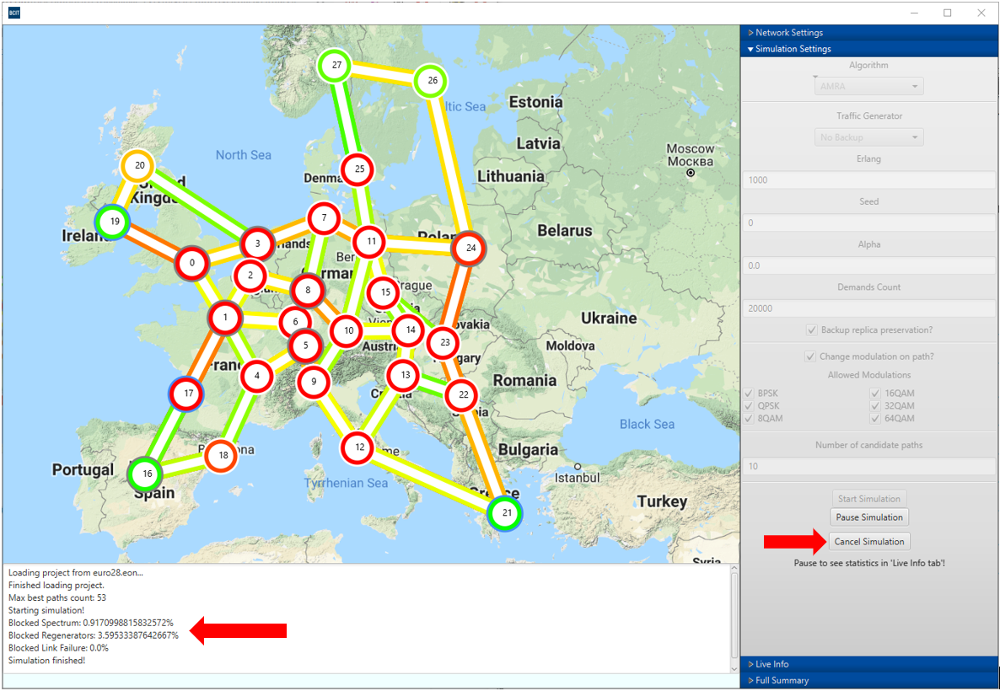

Figure B: Clearing the simulation when it’s finished, simulation results shown in the console

## 3)  Restarting a simulation after cancel/clear

Traffic Generator will be reset after cancel/clear simulation. Please remember to Set Generators Traffic.

1. In **Simulation Settings**, click **Traffic Generator** and select **No Backup** or **Dedicated Backup** or **Shared Backup**

2. Click **OK**

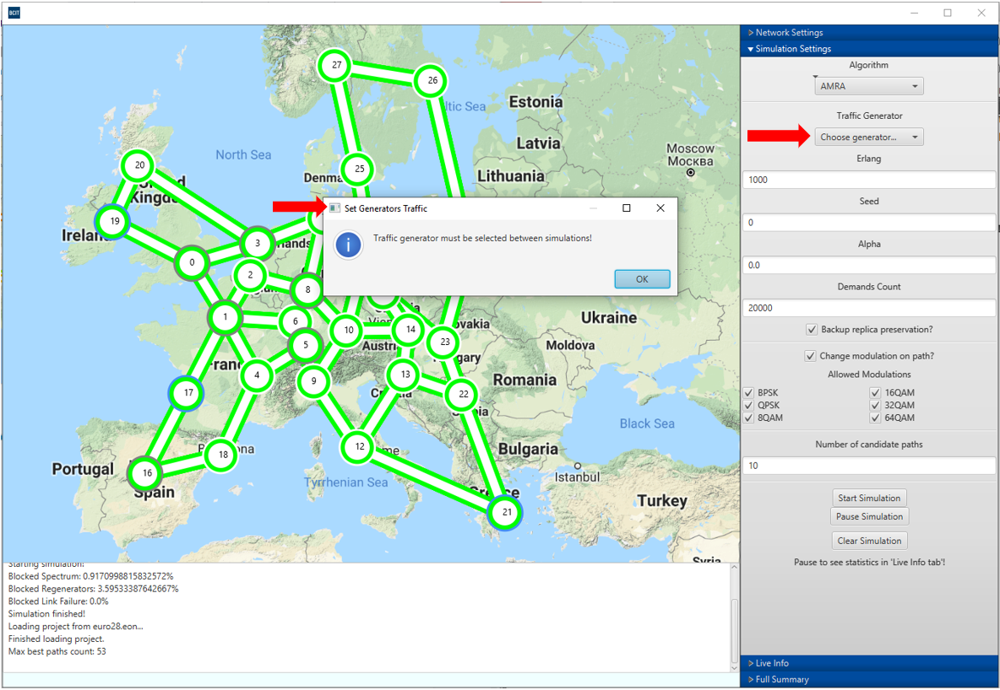

Figure C: Setting Traffic Generator after cancel/clear and map load

# VII.  To see live simulation statistics

## 1.0)  Pause Live Simulation

1. In **Simulation Settings**, press **Pause Simulation**

2. Live Info panel will automatically open

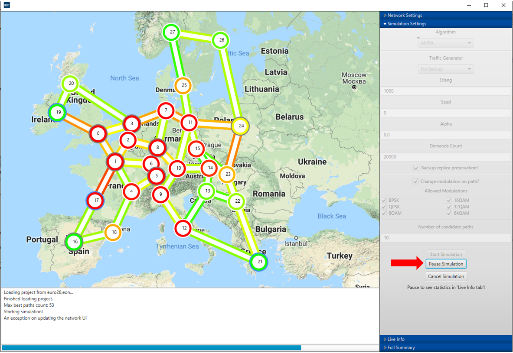

Figure A: Pausing the simulation to display the current state of the network

## 1.1)  Blocked Percentages (Spectrum, Regenerators, Link Failure)

1. While initially paused, current blocked spectrum, blocked regenerators, and blocked link failure will be shown in the **Live Info** panel

2. Otherwise, to access this information again when paused, click away from node/link on map within the **map region**

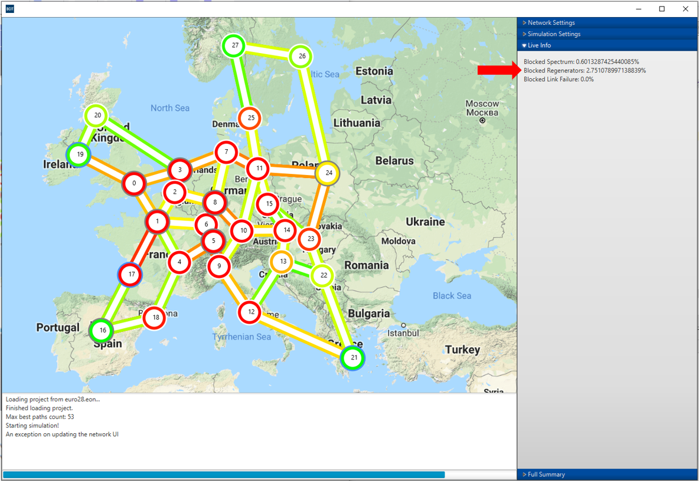

Figure B: Live Info panel populated with current summary statistics on blockage rates

## 1.2)  Individual Node statistics

1. While paused, click on a **node** of interest

2. Node instance information will be populated in the **Live Info** panel

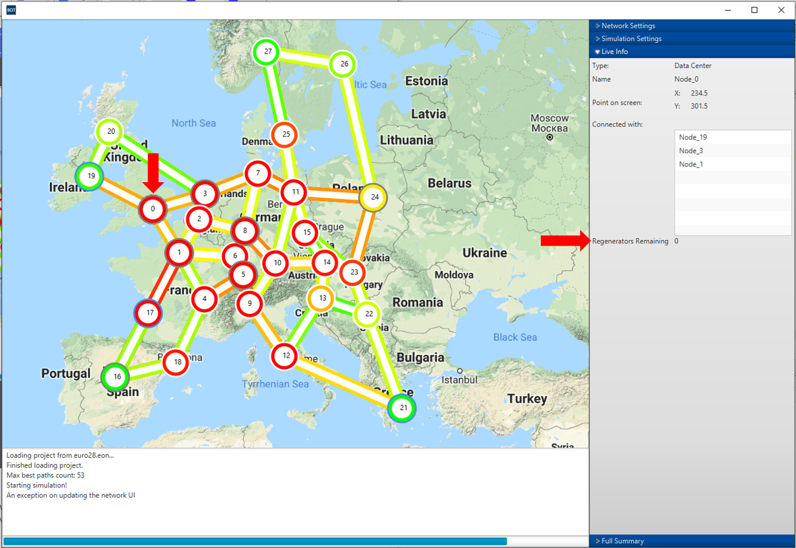

Figure C: Live Info panel populated with the current node information

## 1.3)  Individual Link statistics

1. While paused, click on a **link **of interest

2. Link instance information will be populated in the **Live Info** panel

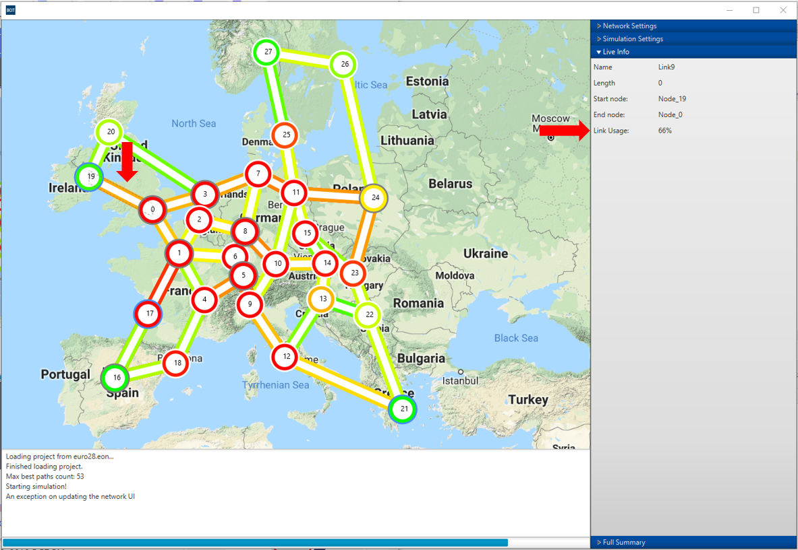

Figure D: Live Info panel populated with the current link information

## 2):  Resuming simulation

1. Click **Simulation Settings** while paused

2. Click **Resume Simulation**

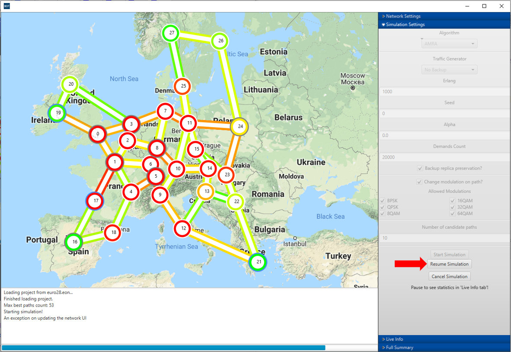

Figure E: Simulation Settings contains the Resume Simulation button

# VIII.  Frequently Asked Questions

## 1)  Why do I get an exception on updating the network UI?

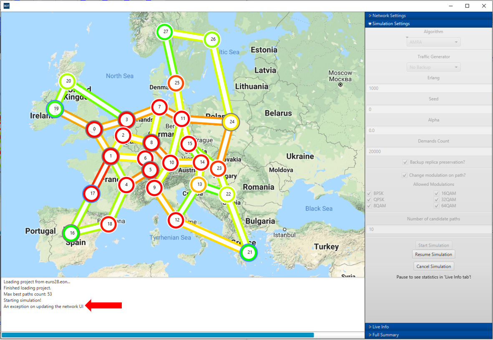

Figure A: Console displays a logged message about the network topology not being updated

Answer: Sometimes, the canvas is not able to update (redraw) the entire topology graphically in time before the next update to the canvas occurs.  An exception is thrown to the console to let the user know if the network topology is not properly updated or completely drawn.  Normally this is not an issue because the updates happen fast enough so the user doesn’t notice.

## 2) Different best paths count between each project load?

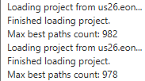

Figure B: Console display different max best paths count from loading the same topology

Answer: The code to calculate the max best paths is dependent on the utilization of CPU/RAM.  If it has low utilization of CPU/RAM the path count will be more accurate;  However, if the application detects a high utilization then it will try to estimate the best paths to reduce loading time.  This means we will generally try to find a good balance between loading speed and accurate path determination.  Overall, this does not have an effect on the simulation.

## 3) Why does node and link color change during simulation?

Answer: In general, the color for node and link represents the resource utilization.  Green means there are plenty of resources left and red means there is a sparse amount of resources.  Any gradient of colors in between (i.e., yellow, orange) is indicative of moderate resource utilization.  Refer to content chapter III, section 6) if you would like a detailed break down of the numbers.  Otherwise, you can click on the node/link while the simulation is paused to analyze how much resource is left.

