**Please cite this paper when you use this simulator in your publications/lectures/presentations:**

**M. Aibin and M. Blazejewski, "Complex Elastic Optical Network Simulator (CEONS)," 2015 17th International Conference on Transparent Optical Networks (ICTON), Budapest, 2015, pp. 1-4. doi: 10.1109/ICTON.2015.7193519**

British Columbia Institute of Technology, Faculty of Computing

All Rights Reserved 

Copyright© 2019

CEONS runnable JAR file (ceons.jar) with three sample networks can [be downloaded from here](http://bit.ly/BCIT_CEONS "Download CEONS"). Please note that you need to have Java installed on your computer.

# I.  Introduction

The Complex Elastic Optical Network Simulator (CEONS) is an open-source desktop application that allows network scientists visualize the statistics and behavior of various optical network topologies using different simulation settings (i.e., algorithms, traffic generators, network requests types/intensity).

This simulator was originally developed by Dr. Michal Aibin and M. Blazejewski as a test environment to allow users to design their algorithms in any programming language and implement them in the simulator as plugins to solve the problems above.  The results of each simulation were displayed onto the console showing the overall requests blocking percentage and link failures.  

Since then, the simulator has evolved to illustrate the network topology within a geographical region and allow users to pause the simulation in real-time to observe resource utilization within each node or link. In the future, users will have the option to create their network topologies, where node locations can be specified with their group membership type, number of regenerators, and node linkage.

This user manual is intended to guide users through the specific use-cases in the graphical user interface provided by the desktop application.  To run the simulator, your operating system needs to run the Java SE Development Kit 8. 

If you need to setup your environment first, please visit the following links to download the recommended resources:

<table>
  <tr>
    <td>JDK 8</td>
    <td>https://www.dropbox.com/s/jxv60eiyd8pj1nq/jdk-8u231-windows-x64.exe?dl=0</td>
  </tr>
  <tr>
    <td>IntelliJ community edition</td>
    <td>https://www.jetbrains.com/idea/download/download-thanks.html?platform=windows&code=IIC</td>
  </tr>
  <tr>
    <td>GitHub repository</td>
    <td>https://github.com/BCIT-SoCAS/ceons</td>
  </tr>
</table>

# II.  Reference Overview

Upon setup completion, you will be able to run the simulator with the following major features:

1. Load network topology from saved .eon files and have it displayed onto the map area

2. Prior to simulation start:

    1. Set algorithm, traffic generator, erlang, seed, alpha, demand count values

    2. Enable backup replica preservation

    3. Enable ability to change modulation on path

    4. Choose allowed modulations

    5. Set number of candidate paths

3. During simulation:

    6. Pause simulation

        1. Select specific nodes to display their group membership, node number, linked nodes, and regenerators remaining

        2. Select specific links to display their length, start/end node, link usage percentage

    7. Cancel or clear simulation

4. Create network topology

    8. Saving Google Maps API key to file

    9. Customize node locations and connected nodes, number of regenerators, and group membership type

# III.  Navigating the application

## 1) Major components

<table>
  <tr>
    <td>Reference Letter</td>
    <td>Component </td>
  </tr>
  <tr>
    <td>A</td>
    <td>Area to hold the map and network topology</td>
  </tr>
  <tr>
    <td>B</td>
    <td>Console for status updates </td>
  </tr>
  <tr>
    <td>C</td>
    <td>Progress bar for map load and simulation</td>
  </tr>
  <tr>
    <td>D</td>
    <td>Network, Simulation, Live Info, Full Summary pane</td>
  </tr>
</table>

## 2) General Settings Controller

**A:** Create topology button that opens up a dialog window where a user can enter a google maps API key.  Once entered the user can generate a network topology to be loaded.

**B:** Load topology button that opens up a file chooser to load .eon files onto the map and network topology area.

**C:** Update topology button that opens up a dialog window where the user can edit an existing network topology.

**D:** Mouse Mode allows you to select from three different modes:

1. Changes the drawing state to none, which has no effect upon user interaction with a loaded network topology.

2. Changes the drawing state to allow user to select a node or link on a loaded network topology.  Once clicked, this displays information in the Live Info pane.

3. Changes the drawing state to allow user to drag a loaded map around.

**E:** Language dropdown allows you to choose the language that the simulator will be displayed in.

## 3a) Simulation Settings Controller (Single Simulation)
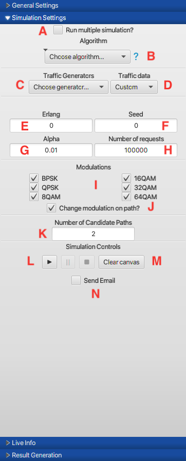

**A:** Turns on/off multiple simulations 

**B:** Choose between algorithm types (e.g., AMRA, SPF), which dictate how routing occurs in the network and/or how optical resources are allocated.

**C:** Choose between traffic generator types (e.g., No backup, Shared backup, and Dedicated backup).  This is the ability for a network to recover from resource failures.

**D:** Choose a year to generate traffic based on the year selected

**E:** Erlang number input determines the network traffic intensity.

**F:** Seed number input is used by a random number generator to make the same simulation multiple times (produces same result).

**G:** Alpha number input determines the probability of link failure.

**H:** Number of requests to be simulated in the network.

**I:** Modulation types to be used during simulation.

**J:** Allows modulation to be changed dynamically in simulation.

**K:** Number of candidate paths for each request to reach a destination.

**L:** Simulation execution controls lets you start, pause and stop a simulation

**M:** Resets the topology to the initial state (in case the topology becomes bugged).

**N:** Allows you to send a email notification when your simulation is done as well as any errors that occurred.

## 3b)  Simulation Settings Controller (Multiple Simulations)

**A:** Turns on/off multiple simulations 

**B:** Choose between algorithm types (e.g., AMRA, SPF), which dictate how routing occurs in the network and/or how optical resources are allocated.

**C:** Choose between traffic generator types (e.g., No backup, Shared backup, and Dedicated backup).  This is the ability for a network to recover from resource failures.

**D:** Choose a year to generate traffic based on the year selected

**E:** The upper (left) and lower (right) limit of the erlang range.

**F:** Amount of simulations run at each erlang (e.g. The amount of simulations run at each step specified in the field below).

**G:** The steps between the given erlang range (e.g. If you have a range of 100 - 150 and the steps you input is 25, simulations would run at 100, 125, and 150).

**H:** Alpha number input determines the probability of link failure.

**I:** Number of requests to be simulated in the network.

**J:** Modulation types to be used during simulation.

**K:** Allows modulation to be changed dynamically in simulation.

**L:** Number of candidate paths for each request to reach a destination. 

**M:** Simulation execution controls lets you start, pause and stop a simulation

**N:** Resets the topology to the initial state (in case the topology becomes bugged).

**O:** Allows you to send a email notification when your simulation is done as well as any errors that occurred.

## 4) Live Info Pane

This section holds live information when the simulation is started and paused.  If a node or link is clicked on when the simulator is paused, it displays the resource usage.  

A node would display it’s group membership (international/data center/standard), how many regenerators it has left, and the other nodes it is attached to.

A link would display the the length of the link, the node it originates from/the node it ends on, and the link spectrum usage.

If neither node or link is clicked on it will display current summary statistics of blocking percentages for regenerators, link and blocked spectrum.

## 5) Result Generation Pane

A: Title of the PDF.

B: The X-Axis Variable

C: The Y-Axis Variable

D: The algorithms and variables to display on graph

E: File path to the folder where the generated pdf will be saved. 

F: Select if you want to open folder after download.

G: Click to preview the PDF.

H: Click the download button to download the PDF to the specified file path.

I: Click to reset to the default parameters.

J: Click to view the generated results data.

## 6) Network topology with nodes and links

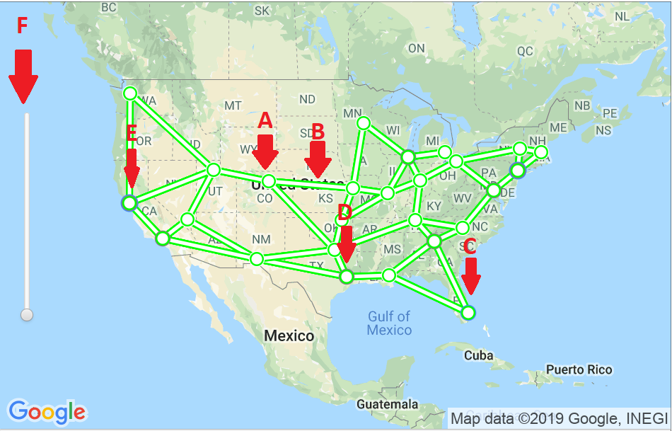

<table>
  <tr>
    <td>Reference Letter</td>
    <td>Component</td>
  </tr>
  <tr>
    <td>A</td>
    <td>Standard node (indicated by white outline)  

The thicker colored line in the node indicates regenerator usage  
Green: Has more than 50 regenerators remaining 
Yellow: Less than 50 regenerators remaining  
Red: Less than 20 regenerators remaining</td>
  </tr>
  <tr>
    <td>B</td>
    <td>Link

The thicker colored line in the link indicates the percentage of link use 
Green: 50% or less link utilization 
Yellow: More than 50% link utilization 
Red: More than 80% link utilization</td>
  </tr>
  <tr>
    <td>C</td>
    <td>International node (indicated by a blue outline)</td>
  </tr>
  <tr>
    <td>D</td>
    <td>Data center node (indicated by a grey outline)</td>
  </tr>
  <tr>
    <td>E</td>
    <td>International and data center node (indicated by a blue and a grey outline)</td>
  </tr>
  <tr>
  <td>F</td>
  <td>Zoom slider that lets you zoom in and out of the map</td>
  </tr>
</table>

# IV.  To load network topology

 1. Click **Load Topology** button.

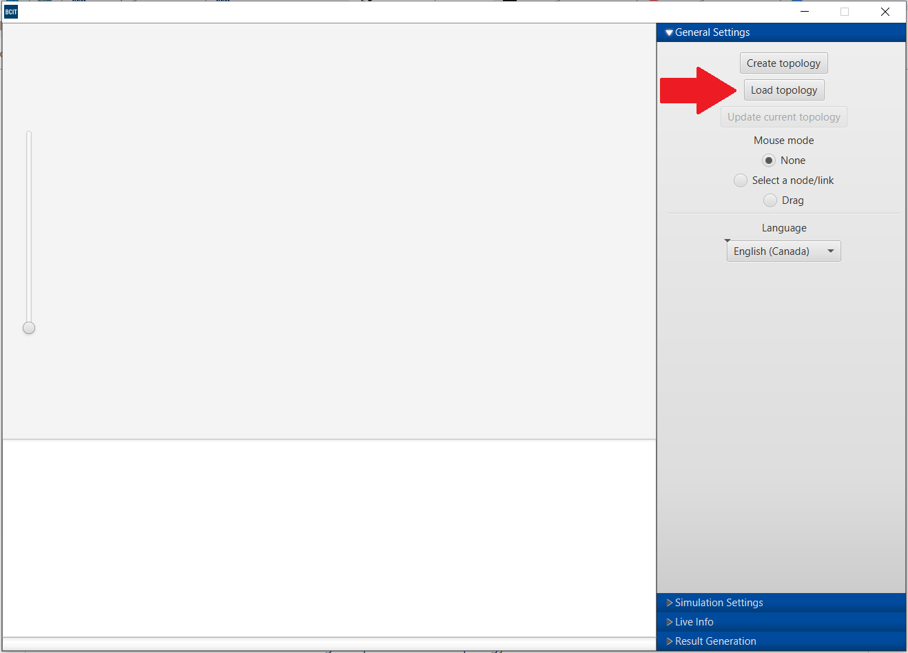

Figure A: Main Menu controller showing network settings

2. Select the available **.eon file** containing complete network topology

Figure B: File chooser to select .eon file types

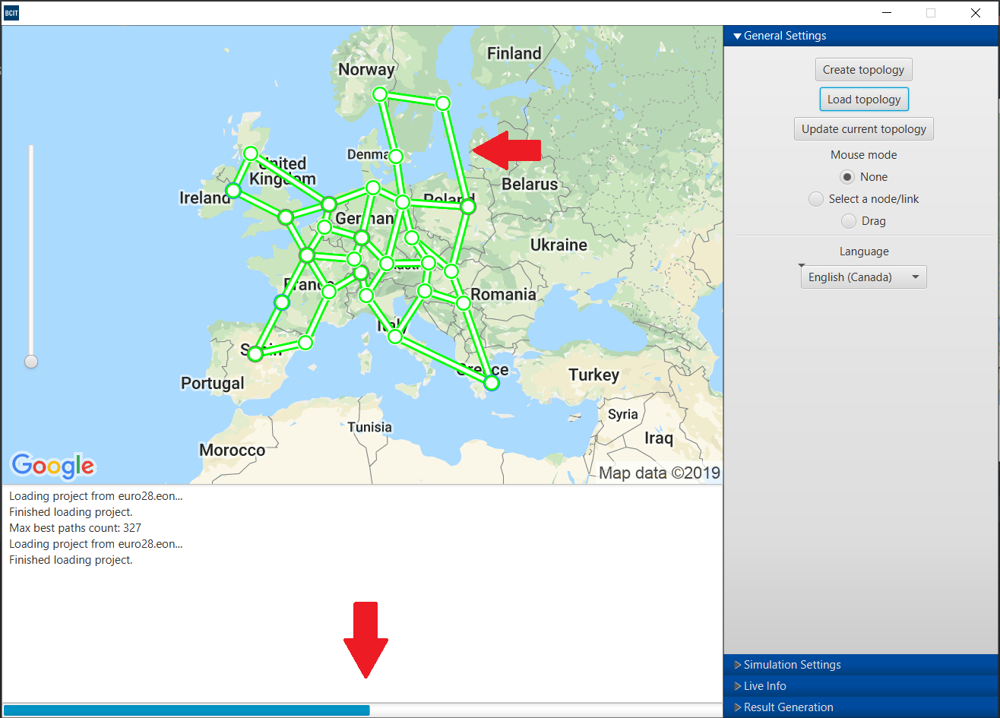

Figure C: Main Menu controller showing network settings

3. Once the selected file is opened, the project will be loaded to calculate the paths available in the network. You must wait for paths to calculate before starting the simulator.

Figure D: Console showing fully loaded project with calculated paths

# V.  To run simulation

1. In **Simulation Settings** section of the main window:

1. Select **Algorithm**.

2. Select **Traffic Generator**.

3. Type **Erlang**, **Seed**, **Alpha** and **Demands Count**. 

4. Select/unselect **Backup replica preservation?**

5. Select/unselect **Change modulation on path?**

6. Select **Allowed Modulations.**

7. Type **Number of candidate paths.**

2. Press the **PLAY** button.

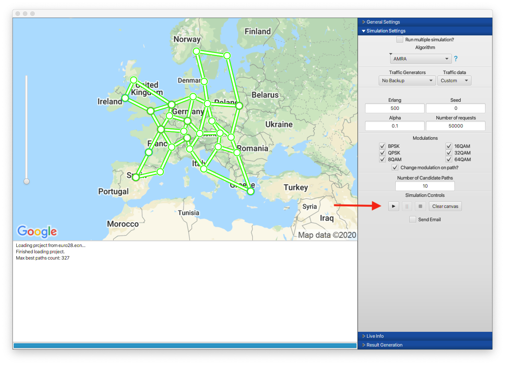

Figure A: Loaded Euro28 network topology

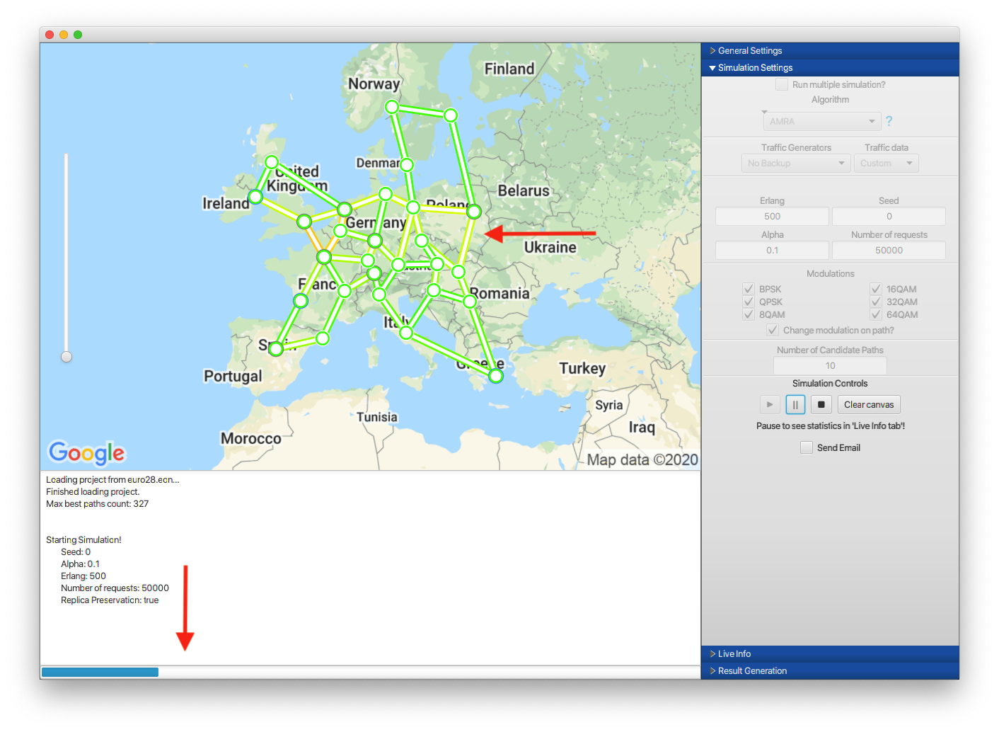

Figure B: Network simulation in progress showing link and regenerator usage

# VI.  To cancel/clear simulation

## 1) Simulation in progress

1. In **Simulation Settings**, click the **STOP** button

2. Click **OK** 

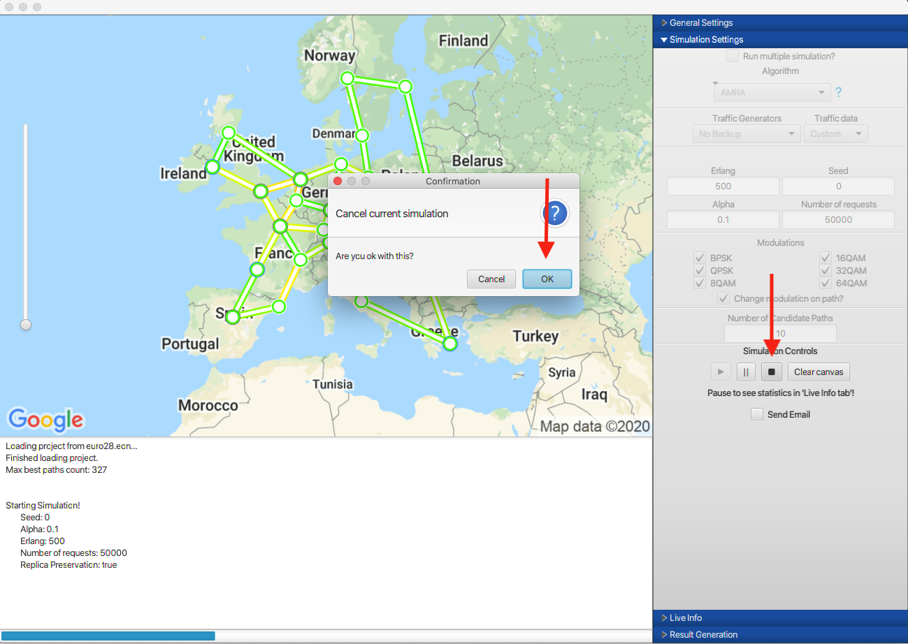

Figure A: Canceling the simulation while it’s running

## 2) Simulation Finished

1. Wait for network topology to finish loading and calculating available paths (this happens automatically after a simulation is done).

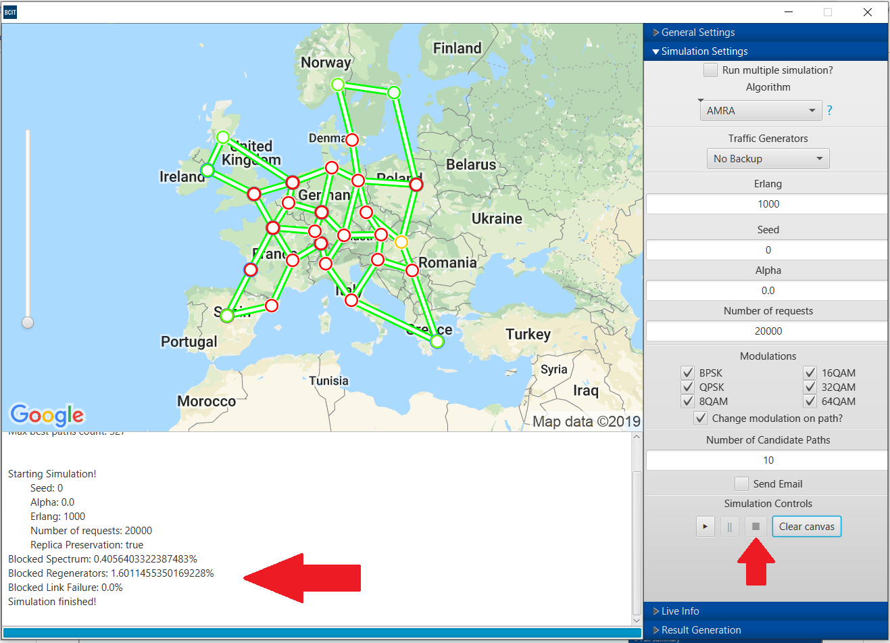

Figure B: Waiting for the simulation when it’s finished, simulation results shown in the console

## 3)  Restarting a simulation after cancel/clear

2. Click the **PLAY** button

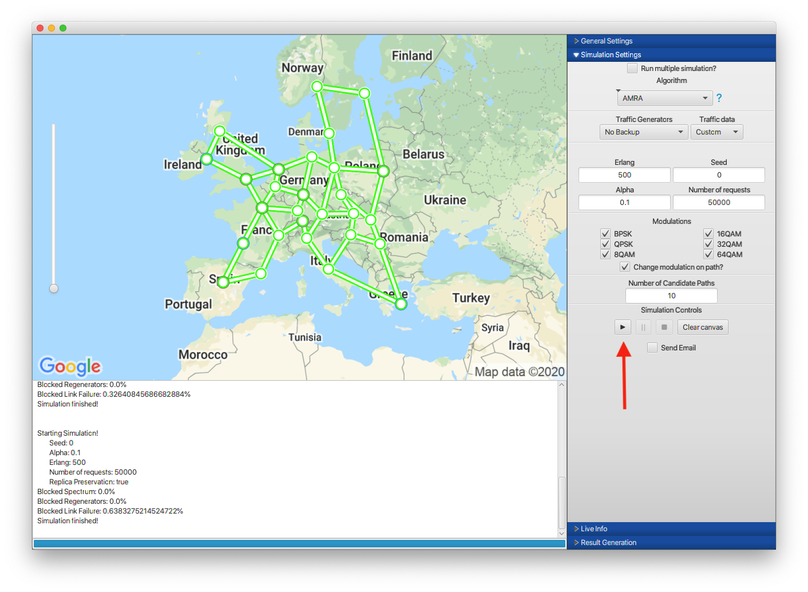

Figure C: Restarting the simulation

# VIII.  To generate a PDF

1. In **Simulation Settings** run multiple simulations.

2. Fill out the form with your desired **PDF Title**, **X-Axis Title** and **Y-Axis Title**

3. Select the algorithms and variables to display on your graph.

4. Choose the folder where you want to download your PDF.

5. Click **Download PDF** to download it into the specified folder.

# VIII.  To see live simulation statistics

## 1.0)  Pause Live Simulation

1. In **Simulation Settings**, press the **Pause** button

2. Live Info panel will automatically open

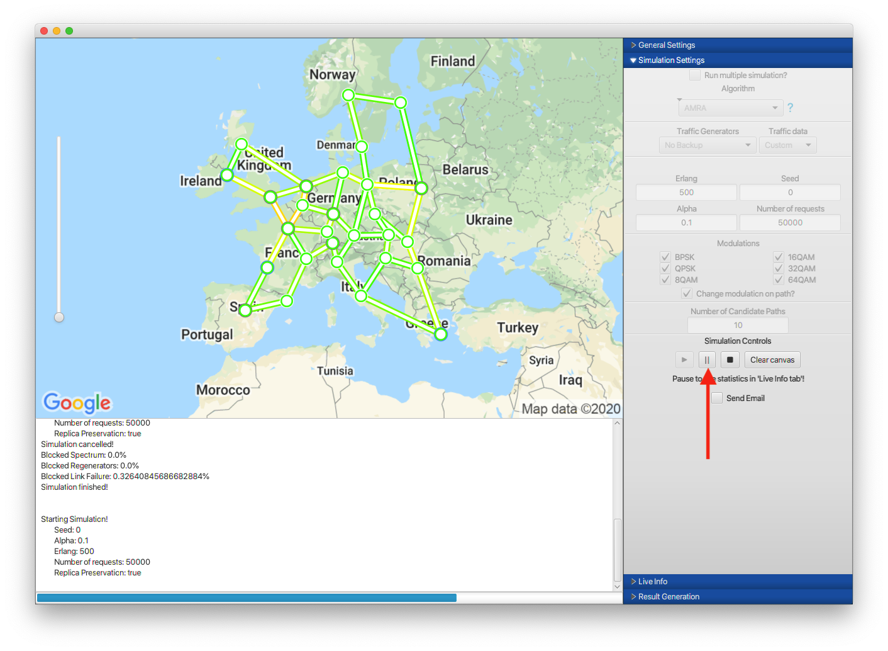

Figure A: Pausing the simulation to display the current state of the network

## 1.1)  Blocked Percentages (Spectrum, Regenerators, Link Failure)

1. While initially paused, current blocked spectrum, blocked regenerators, and blocked link failure will be shown in the **Live Info** panel

2. Otherwise, to access this information again when paused, click away from node/link on map within the **map region**

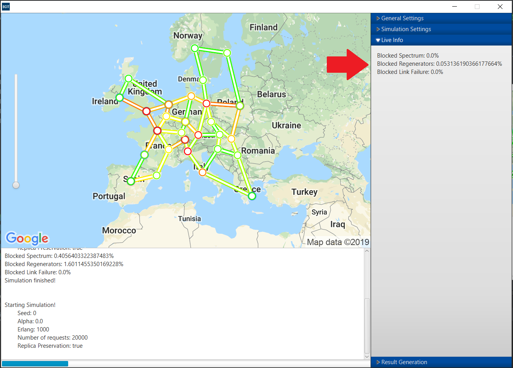

Figure B: Live Info panel populated with current summary statistics on blockage rates

## 1.2)  Individual Node statistics

1. While paused, click on a **node** of interest

2. Node instance information will be populated in the **Live Info** panel

Figure C: Live Info panel populated with the current node information

## 1.3)  Individual Link statistics

1. While paused, click on a **link** of interest

2. Link instance information will be populated in the **Live Info** panel

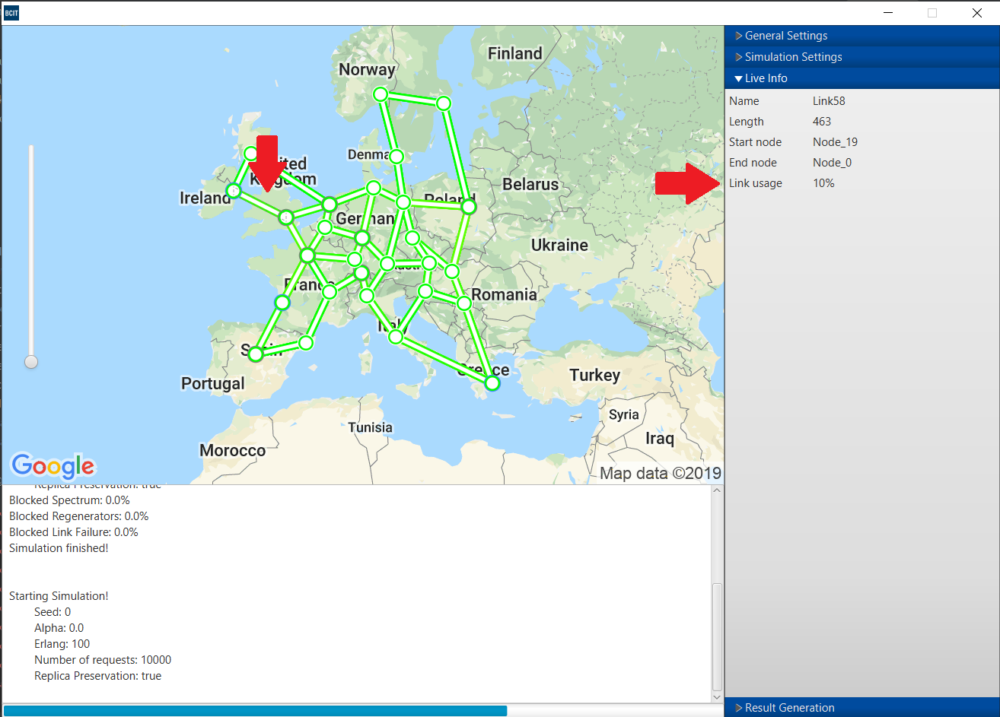

Figure D: Live Info panel populated with the current link information

## 2):  Resuming simulation

1. Click **Simulation Settings** while paused

2. Click **Resume** button

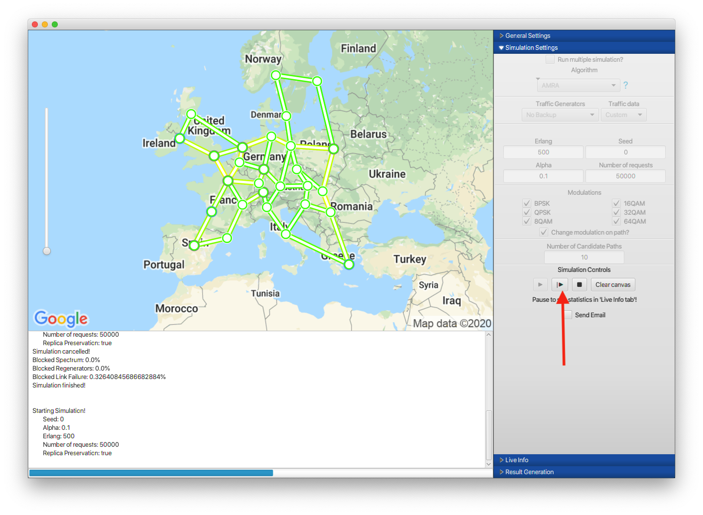

Figure E: Simulation Settings contains the Resume button

# IX.  Frequently Asked Questions

## 1) Different best paths count between each project load?

Figure B: Console display different max best paths count from loading the same topology

Answer: The code to calculate the max best paths is dependent on the utilization of CPU/RAM.  If it has low utilization of CPU/RAM the path count will be more accurate;  However, if the application detects a high utilization then it will try to estimate the best paths to reduce loading time.  This means we will generally try to find a good balance between loading speed and accurate path determination.  Overall, this does not have an effect on the simulation.

## 2) Why does node and link color change during simulation?

Answer: In general, the color for node and link represents the resource utilization.  Green means there are plenty of resources left and red means there is a sparse amount of resources.  Any gradient of colors in between (i.e., yellow, orange) is indicative of moderate resource utilization.  Refer to content chapter III, section 6) if you would like a detailed break down of the numbers.  Otherwise, you can click on the node/link while the simulation is paused to analyze how much resource is left.
